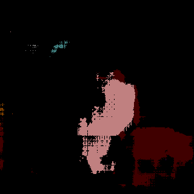

# Fully Convolutional Networks for Semantic Segmentation

## Data
Pascal VOC数据集
数据组织形式：　
/home/my_name/data/VOC/VOCdevkit/VOC2012/JPEGImages

## 工具
pytorch 0.4.1
tensorboardX (可视化工具)


## 注意事项
如果你参考别的项目,遇到训练很多次没有效果,可能是他的loss实现的有问题.你可以换他其他的loss函数重新训练,也可以参考本项目的loss.
交叉熵loss亲测有效.

## 使用说明

### train
python train.py

### evaluate
python evaluate.py

### predict
python predict.py


## 可视化查看
```
cd FCN_pytorch
tensorboard --logdir ./runs
```

## 图片保存:
运行python predict.py,图片保存在指定文件夹中,方便自己查看.

## 结果:



这是训练40epoch的结果,可以看出有一定的效果了.不想继续训练了.就这样了.


